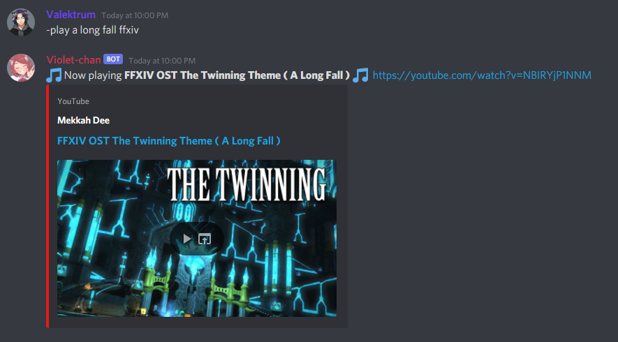
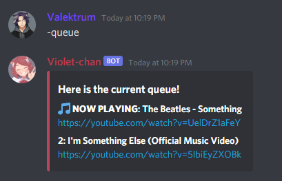
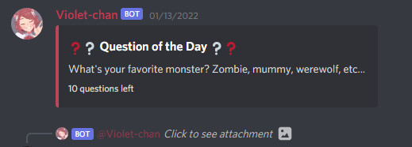

# V-AI

V-AI, also known as Violet, is a custom-built discord bot for my own private discord server.  
This way, I can have total control over my bot, add features along the way and have fun!

# Some of the things Violet can do:

- Play music
  - Play a song by a URL or query
    
  - Skip the current song
  - Stop playing
  - Search for songs using a query
  - Show the server's queue  
    
  - (WIP) Loop the current song
- Flip a coin (heads or tails)  
  
- Give a random number
- Send gifs and pictures
- Link specific YouTube videos
- Make polls  
  
- Ask the question of the day

  - Add question
  - Get the list of questions
  - Post a question daily at 12:00
  - Post a question manually
  - Post a new question manually  
    

- React to certain keywords
- (WIP) Get a league of legends profile  
  
- ....and some other cool interactions!
